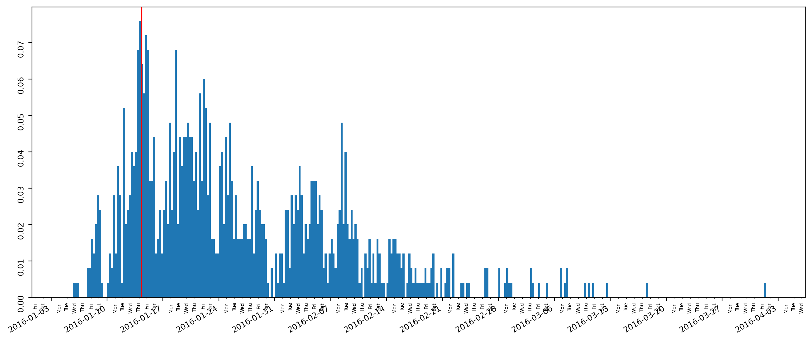

# TaskExecutionTimeMining

This repo demonstrates the applicability of the probabilistic learner DR-BART in Business Process Simulation (BPS) models.
DR-BART was proposed in [Orlandi et al. (2021)](https://doi.org/10.48550/arXiv.2112.12259).

The DR-BART implementation is written in R and C, while we use Python to implement our BPS model.
Therefore, this repo provides a wrapper to use trained DR-BART models from the [implementation of Orlandi et al.](https://github.com/vittorioorlandi/drbart) in Python.
Our wrapper code can be found in this [file](https://github.com/ltsstar/TaskExecutionTimeMining/blob/main/src/TaskExecutionTimeMining/drbart_parser.py).


# Usage

To test DR-BART for BPS, run the following steps:

## Clone the directory, download event logs, install dependencies
run:
```bash
git clone [https://github.com/user/repo.git](https://github.com/ltsstar/TaskExecutionTimeMining)
cd TaskExecutionTimeMining
sh real_data_loader.sh
pip install -r requirements.txt
```
We use pipenv with pyenv. Make sure you have pipenv and pyenv installed and run:
```bash
pipenv install
pipenv shell
```
## Event log preprocessing
To preprocess the downloaded event logs, navigate to the `src\notebooks` directory, select the desired data set folder, e.g. `BPIC_2017` and run the load Jupyter notebook.
E.g., for the BPIC 2017 data set run [this notebook](https://github.com/ltsstar/TaskExecutionTimeMining/blob/main/src/notebooks/BPIC_2017/BPIC_2017_load_all.ipynb).


## Train DR-BART models
If you want to (re)train DR-BART models, navigate into the `models` directory and run the desired .sh files for training.


## Evaluate DR-BART models
Run the evaluation Jupyter notebooks, e.g. [this notebook](https://github.com/ltsstar/TaskExecutionTimeMining/blob/main/src/notebooks/BPIC_2017/DR-BART_evaluation_test.ipynb).

# Demo
Several demo Jupyter notebooks exist, e.g. [this notebook](https://github.com/ltsstar/TaskExecutionTimeMining/blob/main/src/notebooks/BPIC_2017/old/BPIC_2017_single_evaluation.ipynb).


This image shows that our DR-BART models correctly estimate with a low probability that a process will finish on weekends.
